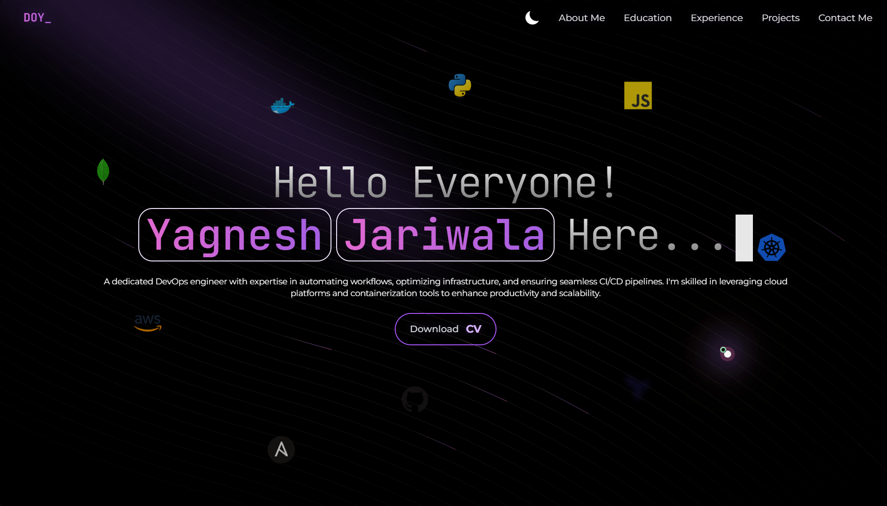

<!-- Profile Header -->

    

    

    
    
    
    

---

<!-- Languages & Tools -->
<h2 align="center">🛠️ Languages & Tools</h2>

    

---

<!-- About Me -->
<h2 align="center">👨‍💻 About Me</h2>

    

<ul>
    <li>💼 <b>Passionate</b> about building impactful software and creative solutions.</li>
    <li>🌱 <b>Always learning</b> new technologies and frameworks.</li>
    <li>🤝 <b>Open</b> to collaboration and networking.</li>
</ul>

---

<!-- Authors -->
<h2 align="center">📝 Authors</h2>

    

